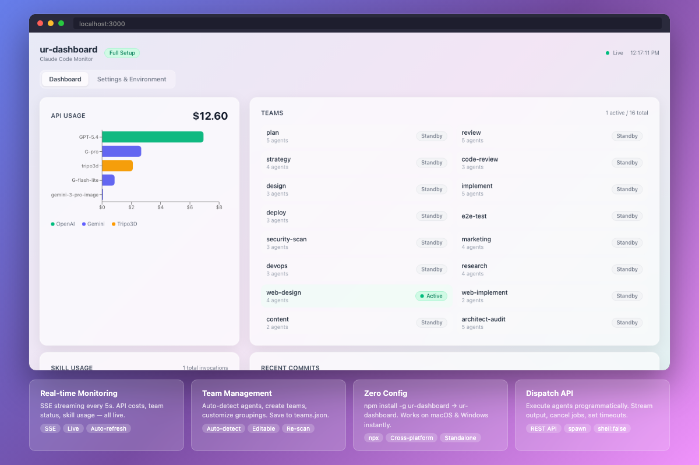

<div align="center">
  
  <h1>ur-dashboard</h1>
  <p><strong>Real-time monitoring dashboard for Claude Code AI agents</strong><br/>
  <em>Your AI agents, visible. One command.</em></p>
  <p>
    <a href="https://www.npmjs.com/package/ur-dashboard">
      
    </a>
    
    
    
    
  </p>
</div>

<p align="center">
  
</p>

---

## Quick Start

```bash
npm install -g ur-dashboard
ur-dashboard
```

Open [http://localhost:3000](http://localhost:3000). That's it.

```bash
# Or try without installing
npx ur-dashboard

# Options
ur-dashboard --port 8080              # Custom port
ur-dashboard --claude-home /path/to   # Custom Claude home directory
```

---

## What You Get

- Real-time visibility into Claude Code agent activity
- API usage and cost tracking at a glance
- Team and skill grouping for multi-agent setups
- Zero-config startup — works on any Claude Code environment
- Built-in dispatch API for programmatic agent execution

### Dashboard Tab

| Panel | Description |
|-------|-------------|
| **API Usage** | Cost tracking across OpenAI, Gemini, Tripo3D |
| **Teams / Agents** | Monitor teams or auto-detected agent groups |
| **Skill Usage** | Skill invocations with frequency and recency |
| **Recent Commits** | Git commits from timeline data |
| **Components** | Scanned `~/.claude/` directory visualization |
| **Recent Activity** | Latest modified files across your environment |

### Settings Tab

| Section | Description |
|---------|-------------|
| **Team Configuration** | Edit agent-to-team groupings, create teams, re-scan |
| **Discovered Components** | Scanned directories with file counts |
| **Config Files** | Configuration files with last-modified dates |
| **Runtime** | Node.js version, platform, dashboard version |

All sections are collapsible.

---

## How It Works

1. **Scans** `~/.claude/` to auto-detect your environment
2. **Streams** data via SSE every 5 seconds — no polling needed
3. **Adapts** panels based on what's available
4. **Saves** team groupings to `~/.claude/agents/teams.json`

Works on **macOS** and **Windows**. Supports environments with or without a custom orchestrator.

---

## Competitive Landscape

| Tool | Zero Config | Claude Code Native | Open Source | `npx` Install |
|------|:-----------:|:------------------:|:-----------:|:-------------:|
| Langfuse | ❌ | ❌ | ✅ | ❌ |
| Helicone | ❌ | ❌ | ❌ | ❌ |
| LangSmith | ❌ | ❌ | ❌ | ❌ |
| **ur-dashboard** | **✅** | **✅** | **✅** | **✅** |

---

## Configuration

| Variable | Default | Description |
|----------|---------|-------------|
| `CLAUDE_HOME` | `~/.claude` | Claude data directory |
| `JARVIS_PRICING_PATH` | built-in | Custom pricing file path |

<details>
<summary><strong>Advanced configuration</strong></summary>

### dashboard.config.json

```json
{
  "refresh_interval": 5000,
  "data_path": "~/.claude/orchestrator/state",
  "teams_path": "~/.claude/orchestrator/agents/teams.json",
  "port": 3000
}
```

### pricing.json

```json
{
  "models": {
    "gpt-5.4": [2.5, 15.0],
    "claude-sonnet-4-6": [3.0, 15.0]
  },
  "tripo_price_per_task": 0.3,
  "default_price": [1.0, 3.0]
}
```

</details>

---

## Dispatch API

<details>
<summary><strong>Programmatic agent execution</strong></summary>

```bash
# Run an agent
curl -X POST http://localhost:3000/api/dispatch \
  -H "Content-Type: application/json" \
  -d '{"agent": "my-agent", "prompt": "Do the thing", "permissionMode": "plan"}'

# Stream output
curl -N http://localhost:3000/api/dispatch/{jobId}/stream

# Cancel
curl -X DELETE http://localhost:3000/api/dispatch/{jobId}
```

Requires `claude` CLI in PATH. Max 3 concurrent jobs. Timeout: 300s default.

</details>

---

## Tech Stack

- **Next.js 16** — App Router, Standalone
- **React 19** — Server & Client components
- **Tailwind CSS 4** — Glassmorphism UI
- **Recharts** — Cost visualization
- **SSE** — Real-time streaming

## Development

```bash
git clone https://github.com/whynowlab/ur-dashboard.git
cd ur-dashboard
npm install
npm run dev
```

## License

[MIT](LICENSE) — free to use, modify, and distribute.
